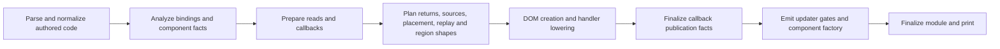

# Compiler phase boundaries

The browser payload measurements and proposed interaction/lifetime contracts
are documented in [Browser JavaScript architecture](./browser-bundle-architecture.md).

## Direction

Separate authored-language meaning from the code a rendering target needs.
Normalized JSX, lexical reads/writes, opaque and async provenance, component
composition and control-flow plans belong to shared analysis/planning. Node
creation, factory ABI, registration, templates, hydration operations and target
runtime imports belong to backend lowering/emission.

The current compiler remains the implementation being migrated. The DOM and
existing SSR paths remain functional. Native/mobile/desktop backends are not
implemented by this change.

## Implemented boundary

`planning/component-render.ts` takes normalized component paths and exact
expression-source contracts from semantic planning. Its
`ModuleRenderPlan` contains component names/source paths and the existing return
contract: direct JSX or a branch selector, branch content and replaced source
statements, plus `ComponentExpressionSources`, an optional `ComponentPullPlan`,
`ComponentPlacement`, `ComponentRegionReplay`, `ComponentRegionShapes` and
`ComponentListSites`. `ComponentRenderInputs`
names the separate fact producers at the module planning boundary.
Contracts are read-only. No generated identifiers, DOM node operations,
registration policy or runtime
namespace is allocated by this pass.

`emission/dom.ts` consumes the complete module plan. Component emission receives
one `PlannedComponent`, and no longer discovers return control flow. All return
plans are validated before any factory is replaced. This removes dependence on
which earlier component has already been emitted.

`planning/expression-sources.ts` captures owner state/props, resolved derivation
roots, opaque/transparent/module sources and callee proof inputs before factory
mutation. The source-query implementation in `analysis/expression-sources.ts`
has no `Ctx` dependency. Its queries return sorted root names, `[]` for no exact
reactive sources, or `null` for unknown attribution. The DOM emitter translates
those roots to numeric and structural runtime reasons; it no longer rebuilds
derivation maps for each slot or reads mutable analysis maps for that proof.

Queries still walk their expression: text normalization combines and clones
expressions during emission. No expression cache assumes a mutable AST is
unchanged. Summarized helpers retain their existing proof; an unindexed cloned
global call remains conservative. This boundary preserves current behavior;
it does not broaden which calls or getters the compiler regards as safe.

Exact sources and opaque pull independence are separate facts.
`planning/primitive-pull.ts` snapshots primitive initializer/write dependencies,
lexical eligibility and authored callback completion before backend mutation.
`analysis/primitive-pull.ts` resolves those dependencies after the emitter
supplies the finalized callback-publication decisions. Finalized queries do not
read mutable `Ctx` or re-inspect authored initializers/writes. Escaped callbacks,
throws, hidden reads, shadowing, dynamic scope and unsupported values remain
conservative. This is an explicit two-phase contract: finalizing before handler
lowering finishes would miss publication; capturing completion after lowering
would mistake generated calls for authored effects.

The shared primitive grammar in `analysis/plain-scalar.ts` also serves list
allocation proofs through the existing context adapter. Both consumers retain
their own lexical eligibility rules. Async provenance, effects and ownership
retain their current collectors.

`planning/component-placement.ts` captures listed-component status, row item
bindings and paths, common key paths, collection ownership, external reactive
inputs, local-effect presence and route ownership before factory mutation.
Local and linked callers feed the same contract. Unknown or incompatible key
paths retain the conservative fallback; the planner does not broaden key proofs.
The backend attaches runtime IDs and chooses factory ABI and ownership cleanup.

`analysis/route-selectors.ts` collects imported route reads in one traversal per
component, including multiple aliases. Dynamic or indirect reads fall back to
whole-route subscriptions for that source only. Captured selectors contain
semantic paths and literal query arguments; emission constructs their runtime
expressions without re-analyzing bindings. Other async/effect facts still use
their existing collectors.

`planning/region-replay.ts` snapshots the inputs that decide how structural
content replays: component-owned roots and volatility, module index eligibility,
canonical source keys and binding-checked fixed-position list sources.
`analysis/region-replay.ts` queries those facts without `Ctx`. Fixed-position
proofs stay tied to the indexed map call and source name; cloned calls remain
unproven. Prelude-bearing lists keep general replay. Queries still accept the
current source expression so transparent lowering and cloned content do not
inherit a proof from a matching name alone.

Nested row, branch, route, render-callback and content-slot emission scopes
inherit the lexical owner's replay contract. The DOM backend supplies reason
availability and enclosing-owner forwarding, then constructs reconciliation,
index refresh or conditional updates. Conditional queries retain the existing
root-name and volatility rules; this change does not broaden getter/callback
proofs. Region identities, targeted mutation journals and DOM-only cleanup/ABI
still have their existing mixed ownership.

Canonical key resolution is shared by live context consumers and captured
replay facts through `context/state-keys.ts`; there is one implementation.
The former context-based conditional owner-read helper is removed now that
its consumer uses the captured contract.

`lists/callback-plan.ts` owns callback parameter validation, row derivation
substitution and ordered expression preludes. It returns a `ListCallbackPlan`
without mutating source. The shared list-analysis adapter applies an explicit
normalized-body replacement for the existing const-only normalization case;
expression-bearing blocks remain available to read collection and transparent
source lowering. List source/target/key queries consume captured semantic inputs
through the shared site planner.

`handlers/analyze.ts` captures callback writes as a `HandlerWritePlan` over an
exact parser-neutral clone. It leaves the authored callback and emission header
untouched. The coordinator in `handlers.ts` passes that plan to
`emission/handler.ts`, which lowers guarded list operations and scheduling
commits after analysis completes. `handlers/plan.ts` owns the shared contract;
write routing no longer imports its execution-site type from instrumentation.
The plan carries captured operation facts rather than rediscovering them after
AST changes. General handler routing still uses `Ctx` and existing mutation
services; this is one boundary extracted from the current compiler, not a
complete target-independent handler IR.

`jsx/conditional-plan.ts` owns branch flattening, source-order selection,
renderable text wrapping and branch key validation. `ConditionalBranchPlan`
contains neither a region suffix nor DOM operations. Read analysis combines
this shape with its source occurrence counter; DOM emission supplies its own
counter and runtime owner.

`planning/region-shapes.ts` prepares JSX-bearing shapes after shared read/callback
lowering, before factory emission. It walks normalized row and branch content,
including the cloned JSX produced by row substitutions and text wrappers.
Emission consumes the resulting shapes through `ComponentRegionShapes`. Newly
cloned attribute/slot content and delegated non-JSX callback syntax use the same
pure normalizers on demand; they do not inherit lexical optimization proofs.
These lookups use no mutable `Ctx`, generated IDs or backend statement buffers.
Shape plans reference AST nodes owned by this compilation, rather than frozen
trees reusable across backends.

`lists/site-plan.ts` owns source classification, row component/delegated-callback
recognition and ordered key extraction. `planning/list-sites.ts` captures local
and opaque roots, module state kinds, frozen initializers, known component names
and prop reference contracts once per component before any factory is replaced.
`ComponentListSites` queries those facts without `Ctx`; DOM list emission no
longer calls the context-based `analyzeMapSite` adapter. Shared read collection
uses the same semantic planner through that adapter. Map matching is shared
with delegated-callback discovery through `lists/source-shapes.ts`.

Analyzed source identities are copied by exact map-call identity. Queries use
the current source expression, preserving later transparent async expansion.
Clones acquire no cached identity; nested member lists require explicit parent
row ownership. Key/spread ordering, deferred getter evaluation, optional sources
and callback item/index validation retain their existing rules. Occurrence
suffix allocation and the explicit normalized-body replacement stay in a
separate adapter. No DOM instructions or generated names are allocated by the
site planner.

This boundary still recognizes already lowered transparent-data helper calls
using the captured runtime namespace identifier. That compatibility is an
explicit remaining dependency on shared runtime-producing normalization;
semantic async provenance must eventually replace it. These source contracts
do not constitute a complete target-neutral IR or broaden optimization proofs.

`lists/item-write.ts` supplies one indexed-item write parser for journal
discovery and handler key construction. `analysis/list-mutation-journals.ts`
collects candidate paths once per component, rather than walking its complete
body for each eligible list. Candidate eligibility describes owned state and a
direct key path without allocating generated names or DOM operations. It is
only a candidate: handler routing still checks lexical origins, plain-data
assignments, accessors and key-changing writes before publishing a targeted
reason. Unknown receiver effects keep content-safe reconciliation.

The final unique-source journals are copied and frozen before backend use.
`ComponentListSites.mutationFor` indexes them by the original map call; cloned
maps acquire no journal. Nested factories inherit this lookup with other list
facts. Handler routing consumes captured source lookups. The redundant mutable
per-call journal map is removed from `Ctx`; one source registry remains for
shared discovery and closed-record analysis. Two independent list consumers
of one source still disable the journal.

Runtime journal binding names and reason addresses are still allocated by the
read-analysis adapter to preserve allocation order and generated output. They
are explicit compatibility data in the snapshot. Fully separating publication
and binding allocation from shared discovery remains work for a later phase.

`analysis/owner-list-structure.ts` proves closed array/record ownership and
which writes preserve retained contents. Each inline row render reads only
own primitive item fields, its index, or a separately published owner selection
value in strict equality with an item field. Dense literal allocation, explicit
indexed reorders/replacements and literal truncation are supported. Minimum
extents bound every indexed access, preventing inherited indexed getters after
truncation. Bounded direct scalar-field assignments in inline owner host-event
callbacks retain the record proof and publish ordinary content causes. Other
content callbacks, including custom-element constructors, cannot promise that
publication and disable the proof. Content-only sources allocate no extra cause.
Aliases, other field writes (including
loop/destructuring targets and row-handler mutations), opaque
methods/factories, spreads, getters, other external row reads and component rows retain
ordinary replay. Dynamic scope and HMR disable the proof.

`analysis/plain-list-return.ts` derives return provenance independently of effect
summaries. The linker carries fresh-record fields, input projections and argument
requirements through named imports and closed helper chains. Every input index
is checked against the owner's minimum extent, including discarded reads.
Closed helper copy/concat calls carry the central method table's native operation
requirements to the owner assignment guard. Variable-length retained projections
and fresh-result extents stay distinct from fixed input indices, including through
identity wrappers. Discarded native results still contribute guard requirements.
Unproven methods, captured storage, escaping allocations and opaque producers do
not acquire a return fact. Authored calls and their execution order are preserved.
`analysis/published-owner-dependency.ts` checks that selection writes belong to
closed host-event call paths; escaped callbacks cannot justify skipping content.

The analysis records original list-call/source identity and ensures the owner
has numeric reasons for that source. Wholly structural bindings use the existing
source cause. Bindings permitting scalar content writes allocate one separate
structural cause; source-reader gates recognize both numeric causes. Original
structural assignment facts transfer only through the handler's exact deep clone.
Ordinary writes dominate safe ones within each function scope and dirty batch.
Guarded root sites use the whole completed scope when another site could already
have changed content before publication. Proven indexed replacements also bypass
the journal's generic unknown-setter fallback. `planRegionReplays` captures source
and reason before emission. Clones, changed source expressions and callback
preludes cannot acquire the proof. The DOM emitter uses the existing
`reasonsOnly` protocol with a hoisted reason array: any unrelated, opaque or
full-update cause retains content replay. Runtime key/order validation,
replacement-item updates and index sensitivity remain unchanged. Supporting
broader producers and write shapes remains open; component rows need a
props/hidden-read proof. No new runtime API is introduced.

`RegionSourcePlans` carries replay, shape and list-site contracts to nested emission
scopes. `newEmitScope` inherits only those source contracts from its caller;
creation statements, node IDs, updater slots and disposal lists stay fresh for
each factory. Ownership counters keep their existing explicit sharing rules.

AST references are owned by one compilation and consumed by its emitter. The
read-only contract does not imply that referenced AST nodes are frozen or that
one consumed plan can be reused by a second backend. A multi-backend build must
give each lowering its own owned tree or immutable semantic representation.

## Remaining coupling

Runtime keyed reconciliation can exploit observed ordering without inferring
authored method behavior. A displaced first row seeds an old-position cursor;
subsequent keys must match its predicted ordered record before reuse. A mismatch
falls back to position/cache lookup, and interrupted frames retain membership
checks. This is distinct from compiler structural-write proof: it does not waive
key evaluation, retained content replay or index refresh, and works with any
producer whose evaluated order satisfies the checks.

Removal-only frames reuse the general path's consumed-record marker. The marker
is installed before retained props/content callbacks and stays active through
removed-row cleanup, so key refresh cannot read the old snapshot using a new
survivor position. Unconsumed rows still expose their previous bindings. A
completed frame publishes the new snapshot before releasing the marker;
interrupted frames retain ownership for general recovery or unmount. Ordered
subsequence and suffix-range removal still avoid map transfer and LIS.

| Concern | Current ownership | Next boundary |
| --- | --- | --- |
| Exact slot-source inputs | Semantic snapshot consumed through `ComponentExpressionSources` | Extend shared facts to other consumers while preserving lexical identity |
| Primitive pull safety | Authored fact plan plus explicit late callback-publication input | Move callback analysis/lowering to a shared phase with target-specific publication |
| Async provenance and effects | Explicit source/availability/direct-read facts and lifetime owner requirements | Finish authored normalization before target lowering; extend callback lifetime reachability |
| Component placement and route selectors | Semantic snapshot consumed by component emission | Extend to structural regions and composition without moving host ABI into shared plans |
| Structural replay eligibility | Semantic contract inherited by lexical emission scopes | Extend to callback shape, branch structure and mutation journals |
| List syntax, sources, targets and keys | Pure normalizers plus captured per-component semantic contracts and async provenance, including clone lookups | Extend the contracts to mutation journals |
| Mutation journals | Shared candidate/path analysis and frozen backend snapshots; one source registry | Move binding allocation and reason publication behind explicit backend contracts |
| Retained row replay for owner writes | Closed structural-only sources capture original-call/source/reason facts; other numeric/journal causes keep full replay | Extend to per-write content/opaque publication and component-row props while preserving mixed-cause fallback |
| Props and region identities | Shared analysis plus backend lowering | Explicit composition and publication contracts |
| DOM-only row proof and ABI | Shared metadata and DOM-specific eligibility | Target-specific ownership/ABI plan derived from shared composition facts |
| Normalization and transparent read/callback lowering | Group presentation validation and lexical captures are planned before target lowering; other transforms remain mixed | Extend explicit source plans to remaining read/callback transforms |
| Generated IDs, headers, imports and output buffers | One mutable DOM emission state referenced by `Ctx`; no mirrored facade fields | Replace remaining runtime-producing normalization with explicit target lowering |
| Generated-header coverage | Deferred header insertion after some rewrites | Passes explicitly cover authored, generated or complete module trees |

These boundaries are not implemented merely by moving files or renaming `Ctx`.
Move one fact's producer and consumers together; then remove the former answer
from emission. Preserve parser origins and binding identity across AST rewrites.
Facts requiring callback analysis must be finalized after that analysis, before
their backend consumer runs.

### Direct async reads and generated call ownership — 2026-10-06

Alias analysis no longer recognizes generated read helper names. Direct payload
reads carry their lexical source binding alongside canonical source identity;
alias resolution still checks that binding in the current scope. Projected values
and multi-source expressions do not acquire a direct origin. This preserves
shadowing and allows module-source render reads to retain honest provenance.

Data lowering identifies compiler-owned call targets through clone-preserved
ownership metadata rather than a generated namespace. That marker only prevents
rewriting an owned call twice; it grants no dependency or write proof. Authored
lookalike calls remain ordinary code. Seven new regressions cover helper
lookalikes, cloned/renamed backends, projection, multiple sources and shadowing.
The compiler build and eight focused suites pass 102 tests.

### Presentation policies before target lowering — 2026-10-06

Program preparation now plans every authored Group pending/error policy before
calling its lowering pass. The source planner accepts only the owned tree,
lexical scope analysis, the Group binding catalog and diagnostics. It validates
attributes and callback signatures, records named references or owned callback
bodies, preserves error/retry aliases and source locations, and captures owner
bindings by identity. It allocates no runtime identifiers, props or component
factories. A later invalid Group fails before any earlier policy allocates or
mutates source.

Group lowering requires that plan. It emits the existing private props/factory
ABI without rediscovering captures or validating callbacks. TSRX uses the same
lexical capture planner and the same target capture-prop encoder. The old mixed
collector and redundant post-plan `data` validator were removed; there is no
compatibility fallback or second runtime. Plans own cloned callback bodies;
their source-node references belong to the same compilation.

This separates one concrete normalization contract. Source dependency inference,
TSRX boundary validation, other read/callback transforms and module finalization
still require further separation. It does not implement another backend or
remove routing, Group, pending/error presentation, retry or lifetime support.

The new self-contained contract suite covers 20 cases. Existing inline-policy
execution now checks captured owner changes, aliased error/retry bindings,
failure, pending retry and successful recovery. Six paired production fixtures
against `5fef5d5` preserve every HTML/payload/browser byte, including all future
policy code. The new inline Group control is 45,802 raw / 14,968 gzip browser
bytes. This batch makes no bundle-size or CPU improvement claim.

Compiler build, workspace typecheck and changed-source lint pass. Eleven focused
suites pass 163 tests; the final validator-removal gate repeats four of those
files and passes 47 cases. Production Chrome navigation and lazy-route lifetime
checks both pass. The routed check first exceeded 60 seconds while the DOM
comparison was active; it passes when run separately, without changing its
deadline or assertions. The entire root suite was not repeated for this batch.

The local compiler comparison against `5fef5d5` passes all 21 DOM scenarios and
mixed sequences across eight compiled variants plus vanilla, checking text,
classes, order and retained identity after every timed sample. Three samples run
in ABBA order. The before/after browser hashes are identical, so noisy local
timings establish no speed change. Final compiler output is also checked against
all eight recorded component modules after the coordinator/validator cleanup.

## Migration order and gates

1. Return/control-flow planning is implemented. Keep generated output unchanged.
2. Exact slot-source inputs now have a separate contract. Continue consolidating
   expression facts and trace writes through reason publication to
   list validation and row replay. VM evidence points to rotation, first-row
   removal and broad retained work. Remove duplicated work only after proving
   what each stage contributes; preserve hidden reads and mixed dirty causes.
3. Plan host children/attributes, structural sites and composition independently
   of runtime construction. Keep refs, effects, data policies and route ownership
   explicit in those contracts.
4. Split configuration/analyzed facts from mutable backend state. Move generated
   module finalization behind the backend boundary, including header coverage.
5. Introduce another target only when its concrete host/lifecycle contracts exist.

Each step requires self-contained contract tests and cross-feature execution:
opaque props/pulls, linked helpers, effects/refs, async rows, routes/request cells,
hydration and failed-render ownership. Compiler-regenerated benchmark output is
compared for unintended changes. Browser gates verify text/classes/order and
retained nodes. Benchmarks measure the complete path; an isolated simplification
does not establish an overall speedup. Dependency versions and pinned upstream
benchmarks stay unchanged. Bundle-size claims require whole delivered graphs;
CPU claims require a separate controlled comparison.

## Validation of the first boundary

Compiler build and changed-source lint passed. Six contract cases verify direct,
tail, if/else and switch returns, source non-mutation, and rejection of a later
invalid component before any factory emission. The broader compiler/DOM suite
passed 158 tests across 11 files, and SSR validation passed 18 tests across five
files. Regeneration leaves tracked benchmark output unchanged. All 25 browser
variants pass retained-node and mixed-sequence gates. This phase change makes
no runtime speed claim.

## Validation of exact source planning

Compiler build and changed-source lint passed. The selected suite passed 204
tests across 12 files, including 17 return/source contract cases, reason gates,
opaque pulls, linked helpers, alias mutations, forms/image callbacks, effects,
routes and hydration. A separate SSR gate passed 18 tests across five files.
Contract tests mutate the analysis context after planning and verify that source
queries preserve their facts, including helper/global clone conservatism.

Compiler regeneration leaves tracked DOM benchmark output unchanged. All 25
browser variants passed identity and mixed-sequence assertions. The browser
runner then exited with a Windows `EBUSY` during temporary-profile cleanup;
the assertions completed before that cleanup error. This change makes no
runtime performance claim; the VM structural-update priorities remain open.

## Validation of primitive pull planning

Compiler build and changed-source lint passed. The two selected suites passed
292 distinct tests across 20 files, including ten new pull-plan contract cases
and the existing primitive-list, opaque-control, callback, effect, linked-helper,
async-form, route, hydration and SSR cases. Contract tests check publication
snapshots, backend AST mutation, synchronous writes, transitive labels and
conservative handling of throws, hidden reads, shadowing and dynamic scope.

All 25 browser variants passed identity and mixed-sequence validation, and the
runner exited successfully. Compiler regeneration leaves tracked DOM benchmark
output unchanged. This boundary establishes no runtime speedup.

## Validation of component placement planning

Compiler build and changed-source lint passed. The selected suites passed 220
tests across 23 files, including eight new placement/route contract cases.
Coverage includes local and linked row sources, aliased props, incompatible
keys, route alias isolation, shadowing, snapshots after source/context mutation,
effects, forms, hydration and SSR.

Compiler regeneration leaves tracked DOM benchmark output unchanged. All 25
browser variants passed retained-node identity and mixed-sequence checks; the
runner exited successfully. This phase change establishes no runtime speedup.

## Validation of structural replay planning

Compiler build and changed-source lint passed. The selected suites passed 217
distinct tests across 26 files, including six new replay-contract cases. They
cover context/factory mutation after capture, lexical shadowing, cloned calls,
canonical keys, prelude/local/member fallbacks, nested lists/conditionals,
render props/children, opaque slots, effects, forms, routes, hydration and SSR.
The six replay cases also passed after canonical key resolution was shared.

Compiler regeneration leaves tracked DOM benchmark output unchanged. All 25
browser variants passed retained-node identity and mixed-sequence checks and
the runner exited successfully. Runtime timing gains remain unverified.

## Validation of region shape planning

Compiler build and changed-source lint passed. The selected suites passed 224
tests across 29 files, including eleven new shape-contract cases. The contract
cases verify non-mutation, ordered callback preludes, const substitutions,
runtime-only parameter clones, shadowing diagnostics, branch selection order,
empty/text branches, keyed-list exclusions and cloned/nested shape lookups.
Execution coverage includes nested composition, render callbacks/props, opaque
slots, effects, forms, routes, hydration and SSR.

Compiler regeneration leaves tracked DOM benchmark output unchanged. All 25
browser variants passed retained-node identity and mixed sequences, and the
runner exited successfully. This change establishes no runtime timing gain.

## Validation of list source, target and key planning

Compiler build and changed-source lint passed. The selected suites passed 312
distinct tests across 37 files, including 12 new site-plan contract cases.
Contract coverage checks non-mutation, optional/module/local sources, explicit
nested-row ownership, key/spread getter ordering, delegated callback validation,
async gating and copied original-call identities. Clearing the analysis context
after capture preserves semantic answers; a clone cannot acquire the original
call's source proof. Existing reactivity, composition, effects, routes, hydration
and SSR gates pass.

All 25 browser variants pass retained-node and mixed-sequence assertions.
Compiler regeneration leaves tracked DOM benchmark output unchanged. This
phase change establishes no runtime performance gain; VM structural priorities
remain open.

## Validation of mutation-journal planning

Compiler build and changed-source lint passed. The selected suites passed 294
distinct tests across 31 files, including 15 new mutation-plan contract cases.
Coverage includes shared item-write syntax, owned/keyed candidate requirements,
lazy scan eligibility, frozen snapshots, original-call identity and disabling
independent consumers. Existing alias, targeted-write, opaque-pull, key,
composition, async/form, effect, route, hydration and SSR cases pass.

Compiler regeneration leaves tracked DOM benchmark output unchanged. All 25
browser variants pass retained-node and mixed-sequence checks. Candidate scanning
is consolidated on the compiler side; no runtime timing gain is established.
The VM priorities remain rotations, first removal and broad retained-row work.

## Validation of contiguous cyclic reuse

Runtime build and changed-source lint passed. The selected suites passed 203
distinct tests across 19 files, including eight new cyclic-cache cases. The
lookup probe verifies one key-cache lookup for complete shifts while preserving
all authored key reads and content updates. Coverage includes failed prediction,
duplicate/recovery paths, SameValueZero keys, immutable replacement items and
an earlier row effect changing a later key. Existing exhaustive reorder,
multi-node/empty-row, cleanup, reentrant unmount, failed-frame, hydration,
reactivity and opaque fallback cases pass.

All 25 DOM browser variants pass identity and mixed-sequence checks. Compiler
regeneration leaves tracked DOM output unchanged. Reduced cache lookup work is
verified independently of timings; end-to-end gains require the next VM run.
The pinned Octane canonical and reorder smoke suites also pass for the
memoized-dom target, including per-operation identity/correctness gates.
The local single-sample timings are not used as comparative performance evidence.

## Validation of removal refresh protection

The six initial regressions failed before the runtime fix. Runtime build and
changed-source lint passed, and the selected suites passed 228 distinct tests
across 21 files, including 13 new removal-refresh cases. They verify props and
content callback reentry, cleanup refresh with replacement items, unconsumed
old-row visibility, interrupted-frame recovery/disposal and structural-only
index precision. Existing exhaustive reorder, failed-frame, cleanup/unmount,
hydration, dirty-render recovery, alias/journal fallback, mixed selection and
image-search form cases pass.

All 25 DOM browser variants pass identity and mixed-sequence checks; compiler
regeneration leaves tracked benchmark output unchanged. The pinned Octane
canonical and reorder smoke suites pass for memoized-dom. These gates establish
correctness and removal of redundant callback replay; they do not establish
comparative timing gains or complete owner-state structural-write proof.
