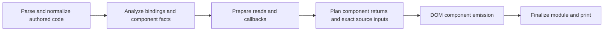

# Compiler phase boundaries

## Direction

Separate authored-language meaning from the code a rendering target needs.
Normalized JSX, lexical reads/writes, opaque and async provenance, component
composition and control-flow plans belong to shared analysis/planning. Node
creation, factory ABI, registration, templates, hydration operations and target
runtime imports belong to backend lowering/emission.

The current compiler remains the implementation being migrated. The DOM and
existing SSR paths remain functional. Native/mobile/desktop backends are not
implemented by this change.

## Implemented boundary

`planning/component-render.ts` takes normalized component paths and exact
expression-source contracts from semantic planning. Its
`ModuleRenderPlan` contains component names/source paths and the existing return
contract: direct JSX or a branch selector, branch content and replaced source
statements, plus `ComponentExpressionSources`. Contracts are read-only. No
generated identifiers, DOM node operations, registration policy or runtime
namespace is allocated by this pass.

`emission/dom.ts` consumes the complete module plan. Component emission receives
one `PlannedComponent`, and no longer discovers return control flow. All return
plans are validated before any factory is replaced. This removes dependence on
which earlier component has already been emitted.

`planning/expression-sources.ts` captures owner state/props, resolved derivation
roots, opaque/transparent/module sources and callee proof inputs before factory
mutation. The source-query implementation in `analysis/expression-sources.ts`
has no `Ctx` dependency. Its queries return sorted root names, `[]` for no exact
reactive sources, or `null` for unknown attribution. The DOM emitter translates
those roots to numeric and structural runtime reasons; it no longer rebuilds
derivation maps for each slot or reads mutable analysis maps for that proof.

Queries still walk their expression: text normalization combines and clones
expressions during emission. No expression cache assumes a mutable AST is
unchanged. Summarized helpers retain their existing proof; an unindexed cloned
global call remains conservative. This boundary preserves current behavior;
it does not broaden which calls or getters the compiler regards as safe.

Exact sources and opaque pull independence are separate facts. Pull independence
still examines analyzed callback completion and lexical writes at its existing
phase. Async provenance, effects and ownership retain their current collectors.

AST references are owned by one compilation and consumed by its emitter. The
read-only contract does not imply that referenced AST nodes are frozen or that
one consumed plan can be reused by a second backend. A multi-backend build must
give each lowering its own owned tree or immutable semantic representation.

## Remaining coupling

| Concern | Current ownership | Next boundary |
| --- | --- | --- |
| Exact slot-source inputs | Semantic snapshot consumed through `ComponentExpressionSources` | Extend shared facts to other consumers while preserving lexical identity |
| Opaque pull safety, async provenance and effects | Several collectors and shared `Ctx` | Distinct fact contracts with explicit pass dependencies |
| Props, list/conditional sites and ownership | Analysis facts plus decisions in emitters | Backend-independent component/region plans with explicit inputs |
| DOM-only row proof and ABI | Shared metadata and DOM-specific eligibility | Target-specific ownership/ABI plan derived from shared composition facts |
| Normalization and transparent read/callback lowering | Mixed semantic and runtime-producing transforms | Authored semantic normalization followed by explicit target lowering |
| Generated IDs, headers, imports and output buffers | Same `Ctx` as source analysis | Mutable emission state separate from analyzed facts and configuration |
| Generated-header coverage | Deferred header insertion after some rewrites | Passes explicitly cover authored, generated or complete module trees |

These boundaries are not implemented merely by moving files or renaming `Ctx`.
Move one fact's producer and consumers together; then remove the former answer
from emission. Preserve parser origins and binding identity across AST rewrites.
Facts requiring callback analysis must be finalized after that analysis, before
their backend consumer runs.

## Migration order and gates

1. Return/control-flow planning is implemented. Keep generated output unchanged.
2. Exact slot-source inputs now have a separate contract. Continue consolidating
   expression facts and trace writes through reason publication to
   list validation and row replay. VM evidence points to rotation, first-row
   removal and broad retained work. Remove duplicated work only after proving
   what each stage contributes; preserve hidden reads and mixed dirty causes.
3. Plan host children/attributes, structural sites and composition independently
   of runtime construction. Keep refs, effects, data policies and route ownership
   explicit in those contracts.
4. Split configuration/analyzed facts from mutable backend state. Move generated
   module finalization behind the backend boundary, including header coverage.
5. Introduce another target only when its concrete host/lifecycle contracts exist.

Each step requires self-contained contract tests and cross-feature execution:
opaque props/pulls, linked helpers, effects/refs, async rows, routes/request cells,
hydration and failed-render ownership. Compiler-regenerated benchmark output is
compared for unintended changes. Browser gates verify text/classes/order and
retained nodes. Benchmarks measure the complete path; an isolated simplification
does not establish an overall speedup. Dependency versions and pinned upstream
benchmarks stay unchanged. Bundle-size work remains deferred.

## Validation of the first boundary

Compiler build and changed-source lint passed. Six contract cases verify direct,
tail, if/else and switch returns, source non-mutation, and rejection of a later
invalid component before any factory emission. The broader compiler/DOM suite
passed 158 tests across 11 files, and SSR validation passed 18 tests across five
files. Regeneration leaves tracked benchmark output unchanged. All 25 browser
variants pass retained-node and mixed-sequence gates. This phase change makes
no runtime speed claim.

## Validation of exact source planning

Compiler build and changed-source lint passed. The selected suite passed 204
tests across 12 files, including 17 return/source contract cases, reason gates,
opaque pulls, linked helpers, alias mutations, forms/image callbacks, effects,
routes and hydration. A separate SSR gate passed 18 tests across five files.
Contract tests mutate the analysis context after planning and verify that source
queries preserve their facts, including helper/global clone conservatism.

Compiler regeneration leaves tracked DOM benchmark output unchanged. All 25
browser variants passed identity and mixed-sequence assertions. The browser
runner then exited with a Windows `EBUSY` during temporary-profile cleanup;
the assertions completed before that cleanup error. This change makes no
runtime performance claim; the VM structural-update priorities remain open.
